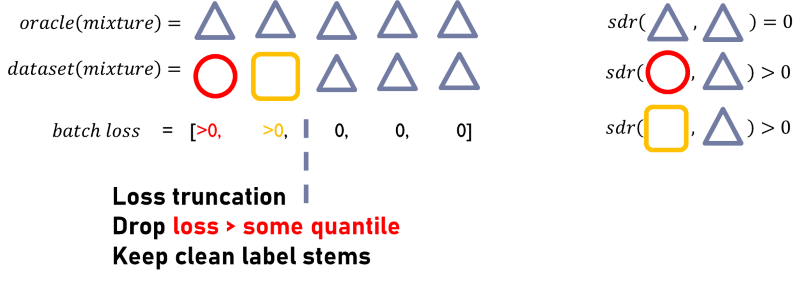

# ccom_mdx2023

### Phase 1: Use loss truncation for robust training

#### loss truncation

The idea comes from the paper "Improved Natural Language Generation via Loss Truncation (ACL 2020)" by Kang et, al. [repo](https://github.com/ddkang/loss_dropper), [paper](https://aclanthology.org/2020.acl-main.66.pdf).

Suppose an oracle model that **perfectly** separate each stems with SDR= $+\infty$:
* True label samples have loss = 0
* False label samples have loss > 0

Then the oracle model is a **perfect** classifier for noisy label / clean label stems using (quantile of) loss as classification criterion.


Sort the loss value in a batch of samples, calculate some quantile of the losses as a threshold, then drop samples above the threshold, the samples with noisy labels can be completed dropped. Only clean stems are kept. 



#### Core code

In practice, we are not allowed to use any oracle / external model. So we heuristically apply the loss truncation function directly from the very beginning of training. We use the training architecture of DEMUCS, in which we simply re-write the loss function part 

```
if args.optim.loss == 'l1':
    # this is DEMUCS implementation
    loss = F.l1_loss(estimate, sources, reduction='none')
    loss = loss.mean(dims).mean(0)
    reco = loss
    
elif args.optim.loss == 'l1_trunc':
    # this is our loss truncation
    loss = F.l1_loss(estimate, sources, reduction='none')
    loss = loss.mean(dims)
    loss = loss.masked_fill(loss > loss.quantile(args.optim.trunc_ratio, dim=0), 0)
    loss = loss.mean(0)
    reco = loss
```

The hyper-parameter `args.optim.trunc_ratio` is the quantile of loss in a batch.

#### training steps

All the following 3 steps uses loss truncation but with different `args.optim.trunc_ratio` and learning rates. All training steps use label noise dataset only. We did not use any external data/model or any human labeling. 
* Step 1: training from scratch 
