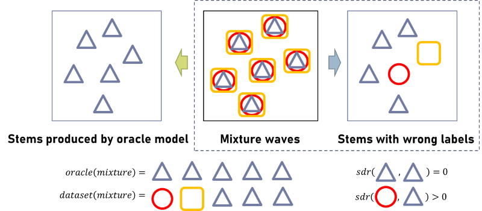
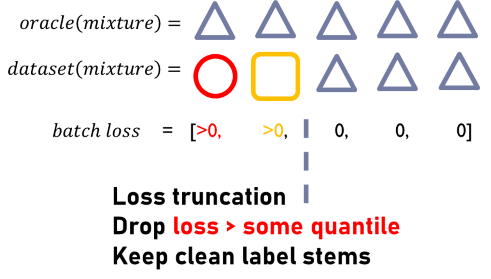

# ccom_mdx2023

The training of our final model on leaderboard A has two consecutive parts. Part 1 was trained from scratch on the label-noise dataset, and Part 2 was built upon the model from Part 1. The entire process does not use any external models, datasets, or human labeling.

## Part 1. Robust training with noisy labels via loss truncation

### Mechanism of loss truncation

The idea comes from the paper "Improved Natural Language Generation via Loss Truncation (ACL 2020)" by Kang et., al. [repo](https://github.com/ddkang/loss_dropper), [paper](https://aclanthology.org/2020.acl-main.66.pdf).

Suppose an oracle model that **perfectly** separate each stems with SDR= $+\infty$:
* True label samples will have loss = 0
* False label samples will have loss > 0

Then the oracle model is a **perfect** classifier for noisy label / clean label stems using (quantile of) loss as the classification criterion.



To filter out noisy labels, sort the loss value in descending order in a batch of samples, calculate some quantile of the losses as a threshold, then drop samples above the threshold, and the samples with noisy labels can be completely dropped. Only clean stems are kept. 



### Core code

In practice, we are not allowed to use any oracle / external model. So we heuristically apply the loss truncation function directly from the very beginning of training. We use the training architecture of [DEMUCS](https://github.com/facebookresearch/demucs), in which we simply re-write the loss function part:

```
if args.optim.loss == 'l1':
    # This is DEMUCS implementation.
    loss = F.l1_loss(estimate, sources, reduction='none')
    loss = loss.mean(dims).mean(0)
    reco = loss
    
elif args.optim.loss == 'l1_trunc':
    # This is our surrogate loss truncation instead of l1 loss.
    loss = F.l1_loss(estimate, sources, reduction='none')
    loss = loss.mean(dims)
    
    # loss truncation
    loss = loss.masked_fill(loss > loss.quantile(args.optim.trunc_ratio, dim=0), 0)
    
    loss = loss.mean(0)
    reco = loss
```

The hyper-parameter `args.optim.trunc_ratio` (truncation ratio) is the quantile of loss in a batch that determines the threshold above which to discard. 

Our results later show that although we do not have such oracle models to perfectly distinguish noise labels, by directly training from scratch on noisy data with loss truncation it still achieves competitive results.

### Training details and results

All the following 3 consecutive steps use loss truncation but with different truncation ratios and learning rates. All steps use **label-noise dataset only**. We did not use any external data/model or any human labeling in our entire training/validation process. 
* step 1: $C=0.7$, bsz=4, drop 1 out of 4, lr=3e-4, 500 epoch joint training
* step 2: $C=0.5$, bsz=4, drop 2 out of 4, lr=1e-4, 200 epoch joint training
* step 3: $C=0.3$, bsz=4, drop 3 out of 4, lr=1e-4, 200 epoch joint training

$C$ denotes the truncation ratio. We use 8 NVIDIA A100 cards for the training, 
and the hyper-parameters of the model are identical to HTDEMUCS's default parameters (except for loss truncation and the learning rate). Joint training means 4 stems are predicted and trained at the same time. There can be at most 4 samples loaded in one A100 card. So setting $C=0.7$ will drop 1 out of 4 samples on the batch, and $C=0.5$ means 2 out of 4, etc.

We find that although we train the model by loss truncation from scratch using the label-noise data only, it can still achieve convergence and a competitive SDR score. After step 3, the model achieves the following SDR on Leaderboard A. (There are no baseline results for Phase 2 on Leaderboard A, so we use baseline results from Phase 1 for a rough comparison.)

| model | Bass | Drum | Other | Vocals | Mean |
| --------- | --- | --- | --- | --- | --- |
| Baseline (DEMUCS) | 5.067 | 5.759 | 3.140 | 5.851 | 4.954|
| Baseline (MDX-Net) | 4.497 | 2.976 | 2.794| 4.870 | 3.784|
| Baseline (UMX) | 3.537 | 3.587 | 2.343 | 4.626 | 3.523|
| Ours (loss trunc., after step 3) | 6.943 | 6.624 | 4.447 | 7.094| 6.277|

### reproducing our results

* Pull the training code from [DEMUCS](https://github.com/facebookresearch/demucs) and install all dependencies. Their implementation is based on [dora](https://github.com/facebookresearch/dora). The value of *xps* is used to track the training chain.
* Unzip the label-noise dataset into `./demucs/dataset/label_noise/train/`. The dir looks like this:
```
demucs
|-+dataset
|---+label_noise
|-----+train
|-------+0a589d65-50a3-4999-8f16-b5b6199bceee
|----------bass.wav
|----------drums.wav
|----------other.wav
|----------vocals.wav
|----------mixture.wav
```
mixture.wav is generated by adding 4 stems together.
* Comment the valid track code in `./demucs/demucs/wav.py`
```
def get_musdb_wav_datasets(args):
    ...
    # Comment and replace this line
    # valid_tracks = _get_musdb_valid()
    valid_tracks = []
    ...
```
* We refine the positional encoding code in `./demucs/demucs/transformer.py` to accelerate the training.
```
# replace create_2d_sin_embedding() with the following.

def create_2d_sin_embedding(d_model, height, width, device="cpu", max_period=10000):
    """
    fix device issue

    :param d_model: dimension of the model
    :param height: height of the positions
    :param width: width of the positions
    :return: d_model*height*width position matrix
    """
    if d_model % 4 != 0:
        raise ValueError(
            "Cannot use sin/cos positional encoding with "
            "odd dimension (got dim={:d})".format(d_model)
        )
    pe = torch.zeros(d_model, height, width, device=device)
    # Each dimension use half of d_model
    d_model = int(d_model / 2)
    div_term = torch.exp(
        torch.arange(0.0, d_model, 2, device=device) * -(math.log(max_period) / d_model)
    )
    pos_w = torch.arange(0.0, width, device=device).unsqueeze(1)
    pos_h = torch.arange(0.0, height, device=device).unsqueeze(1)
    pe[0:d_model:2, :, :] = (
        torch.sin(pos_w * div_term).transpose(0, 1).unsqueeze(1).repeat(1, height, 1)
    )
    pe[1:d_model:2, :, :] = (
        torch.cos(pos_w * div_term).transpose(0, 1).unsqueeze(1).repeat(1, height, 1)
    )
    pe[d_model::2, :, :] = (
        torch.sin(pos_h * div_term).transpose(0, 1).unsqueeze(2).repeat(1, 1, width)
    )
    pe[d_model + 1:: 2, :, :] = (
        torch.cos(pos_h * div_term).transpose(0, 1).unsqueeze(2).repeat(1, 1, width)
    )

    return pe[None, :].to(device)
```
* train step1 with `./demucs/conf/variant/step1.yaml`. This is training from scratch with $C=0.7$, $lr=3e-4$
```
dora run -d variant=step1
```
it produces xps=32200d05, which we type into step2.yaml
* train step2 with `./demucs/conf/variant/step2.yaml`. It continues training from the checkpoint of step 1 with a smaller truncation ratio ($C=0.5$) and smaller learning rate ($lr=1e-4$).
```
dora run -d -f 32200d05 variant=step2
```
it produces xps=4615fb98, which we type into step3.yaml
* train step3 with `./demucs/conf/variant/step3.yaml`. It continues training from the checkpoint of step 2 with a smaller truncation ratio ($C=0.3$).
```
dora run -d -f 4615fb98 variant=step3
```
it produces xps=164037a4, which is the end of our part 1 model, and achieves the metric in the table above. We then apply the trained model to part 2.

If you need to reproduce our results, you should track the different *xps* produced each step and type them into the corresponding yaml file to correctly form the training chain, or use the command line method with something like:
```
# E.g., for step 2:
dora run -d -f 32200d05 continue_from=32200d05 optim.lr=0.0001 optim.loss=l1_trunc optim.trunc_ratio=0.5
```
